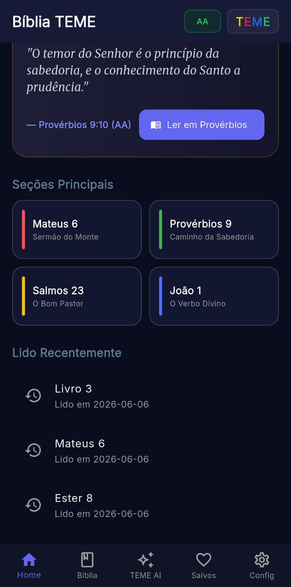
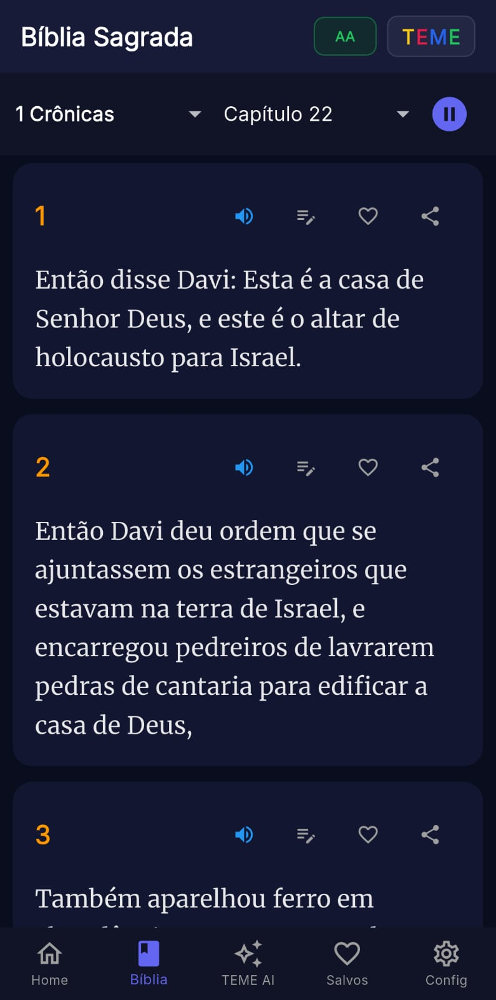
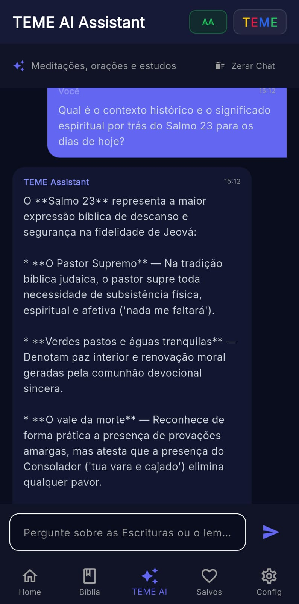
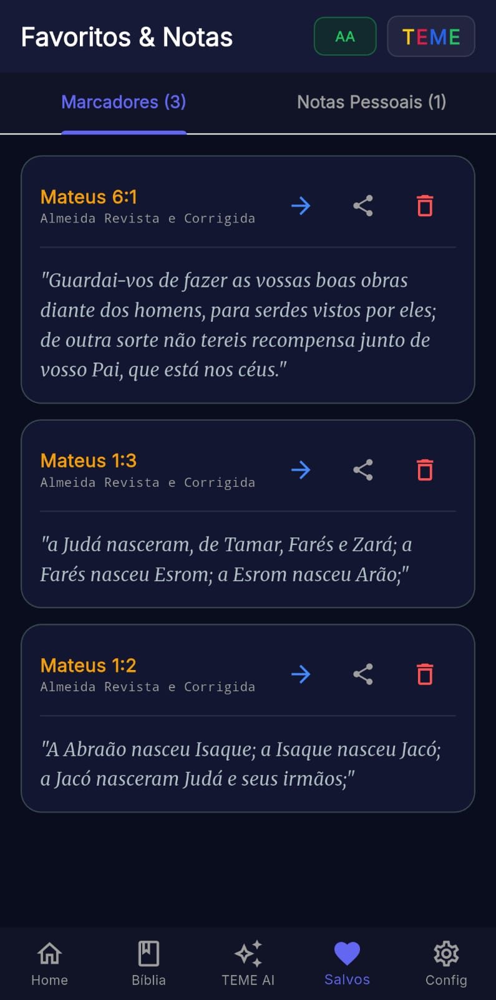
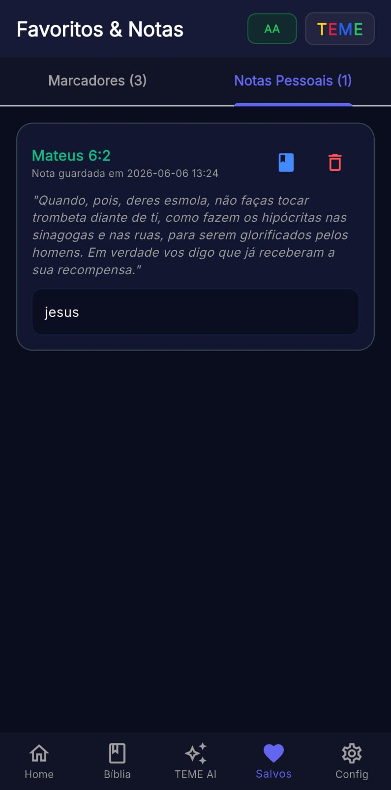
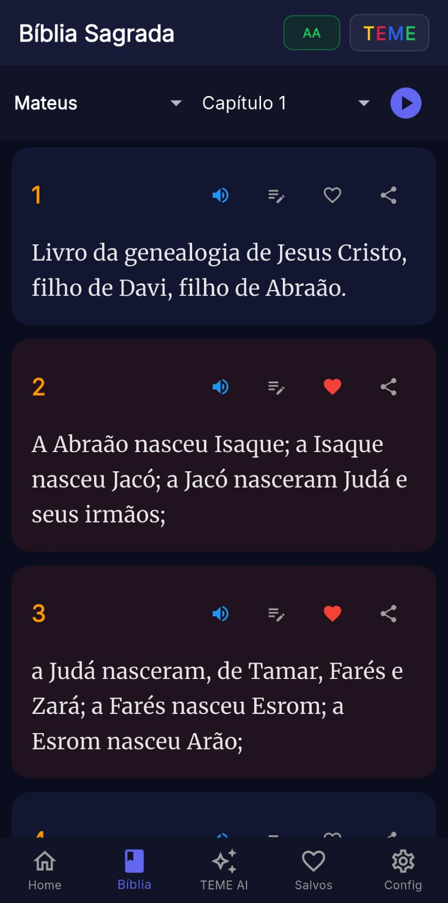
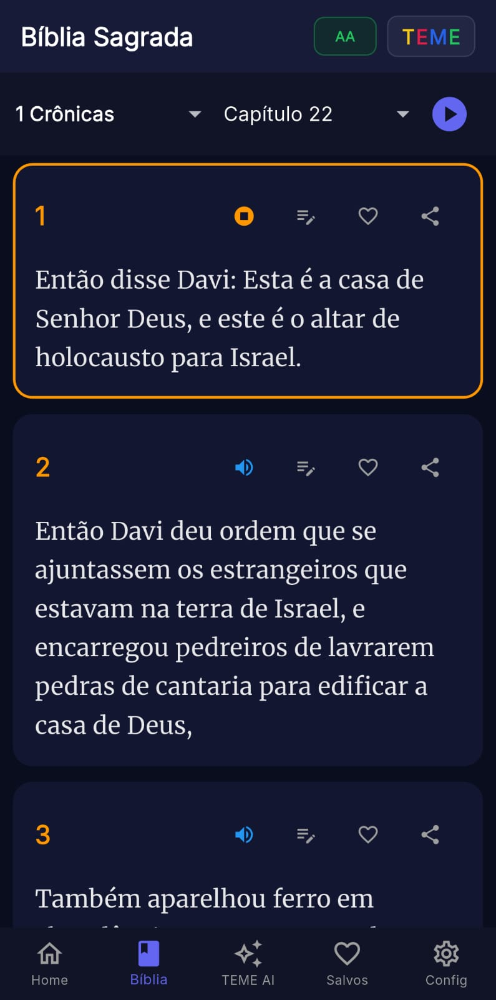
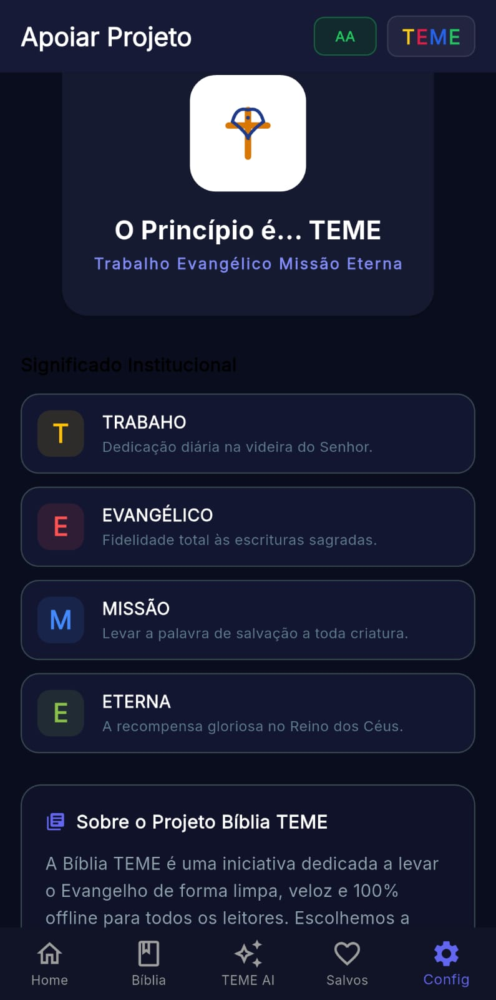

# app_teme
Bíblia TEME 📖✨ A Bíblia TEME é um aplicativo móvel desenvolvido com um objetivo central: tornar a Palavra de Deus acessível, de forma rápida, limpa e funcional, em qualquer lugar do mundo.

🧭 O Significado por trás de "TEME"O nome do projeto é uma sigla para Trabalho Evangélico Missão Eterna, inspirado em Provérbios 9:10: "O temor do Senhor é o princípio da sabedoria, e o conhecimento do Santo a prudência."T - TRABALHO: Dedicação diária na videira do Senhor.E - EVANGÉLICO: Fidelidade total às Escrituras Sagradas.M - MISSÃO: Levar a palavra de salvação a toda criatura.E - ETERNA: A recompensa gloriosa no Reino dos Céus.🛠️ Funcionalidades PrincipaisO Bíblia TEME foi projetado para ser um companheiro de estudo prático e profundo:Leitura Offline: Acesse qualquer livro ou capítulo da Bíblia a qualquer momento, sem necessidade de dados móveis ou Wi-Fi.TEME AI Assistant: Um assistente inteligente integrado para auxiliar em meditações, orações e estudos bíblicos, oferecendo reflexões estruturadas sobre os textos.Versículo do Dia: Uma dose diária de inspiração e reflexão logo na tela inicial.Favoritos e Notas Pessoais: Ferramenta para marcar versículos e registrar anotações teológicas de estudo pessoal.Histórico de Leitura: Navegação inteligente que permite retomar a leitura exatamente de onde você parou.

### 📱 Visão Geral do Aplicativo

| Tela Inicial | Bíblia Sagrada (Leitura) | Estudo com IA (TEME AI) | Favoritos (Visão Geral) |
| :---: | :---: | :---: | :---: |
|  |  |  |  |

 

| Notas Pessoais | Favorito Selecionado | Áudio do Versículo | Configurações & Apoio |
| :---: | :---: | :---: | :---: |
|  |  |  |  |

é um projeto de fé e tecnologia. Se você deseja contribuir com melhorias, correções de bugs ou novas funcionalidades que ajudem a levar a Palavra de Deus mais longe, sinta-se à vontade para abrir uma Issue ou enviar um Pull Request.📜 LicençaEste projeto é distribuído sob os princípios de compartilhamento do Evangelho. (Considere adicionar aqui o tipo de licença, ex: MIT, caso pretenda tornar o código aberto).
